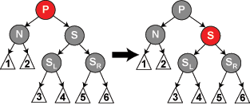

# 红黑树

## 性质
1. 节点为黑或者红色。
2. 根一定是黑色。
3. 所有叶子都是黑色（叶子是NIL节点）。
4. **红色节点不能连续**。如果违反，称为红违反。
5. **黑高平衡**：从任一节点到其每个叶子的所有简单路径都包含相同数目的黑色节点。如果违反，称为黑违反。

当添加或者删除节点使得上面的性质破坏时，通过**交换节点颜色**或者**旋转**来重新平衡。

## 删除
经过转化，可以知道一个前置条件：
**下面要删除的M，最多只有一个非空子节点C**。

> https://zh.wikipedia.org/wiki/%E7%BA%A2%E9%BB%91%E6%A0%91#%E5%88%A0%E9%99%A4

- M: 要删除的节点。
- C：M的儿子。可能为非LEAF节点(独生子)，也可以为LEAF节点(双叶子中任意取一个叶子，为NULL)。

> 参阅：http://gauss.ececs.uc.edu/Courses/c110/lectures/Week2/RedBlack/redblack.html Delete Rules

| #   | M     | C     | Possibility                                                 | Action                                                                 | Description                                                      |
|-----|-------|-------|------------------------------------------------------------------------|------------------------------------------------------------------------|------------------------------------------------------------------------|
| 1   | 🔴   | ⚫(NIL) + ⚫(NIL) | Y           | Delete M, all thing is done.                                 | Current is a red leaf.                 |
| 2 | 🔴   | ⚫/🔴 +  ⚫(NIL) | N                       | -                     | Current is red with one child. |
| 3 | ⚫ | ⚫ + ⚫(NIL) | N           | -                                                            | Current is black with one black child. |
| 4  | ⚫ | 🔴(独生子) +  ⚫(NIL) | Y | Delete M, C replace M position, colorize C Black(balance black height) | Current is black with one red child. |
| 5  | ⚫ | ⚫(NIL) + ⚫(NIL) | Y                                               | **[need to subdivide]**                                                | Current is black and has no children.         |

> #2: This is impossible since the child must be black to avoid two reds in a row on a path but then the number of blacks on paths through the left side of the node is different from the number of blacks on paths through the right side.
>
> #3: This is impossible since the number of blacks on paths through the left side of the node is different from the number of blacks on paths through the right side.

可以得知，转化后：

- 只需考虑 #1 #4 #5 三种情况。#1 #4 都比较简单。

- 对于情况 #5 ，需要进一步考虑，因为要删除一个黑节点M，儿子也不是红节点，黑高必然失衡。
  > 黑高为何会失衡，因为原来经过M的路径，黑节点最终会减1；那么不经过M的路径，黑节点就无端多了1个。

  因此，需要进一步扩大牵扯的结点区域，将附近更多的节点考虑进来，重新构建黑高平衡。

举例直观说明：

### 双黑噩梦

噩梦是个人对红黑树的删除赋予的称号，因为红黑树的删除需要讨论的情况很多，一旦语言组织过差，或者讲解思路不清晰，很容易造成注意力分散以及极高的心智负荷，然后劝退。

> The complex case is when **N** is not the root, colored black and has only NIL children (⇔ no proper child). In the first iteration, **N** is replaced by NIL.

**在要删除的节点和它的儿子二者都是黑色时，此时该节点的两个儿子都是叶子节点。**

> 为什么？
> - 假设1：若其中一个儿子是黑色非叶子节点，另一个儿子是叶子节点， 那么从该节点通过非叶子节点儿子的路径上的黑色节点数最小为2，
而从该节点到另一个叶子节点儿子的路径上的黑色节点数为1，违反了性质5。**不成立**。
> - 假设2：该节点的两个儿子也不可能为全都是非叶子节点，因此一开始的转化使得该节点最多只有一个非空子节点。**不成立**。
  
>   
> 为了直观理解，这里有一张红黑树的示例图。假设一开始要删除的是25这个节点。 那么经过转化，25的左子树的前驱节点的值 20 会赋值到25的位置，然后问题转化为要删除原来的20节点。因此不会出现假设2情况。

为了描述的规范：
- 称呼这个儿子为N（在新的位置上），称呼N的父亲为P。
- 称呼N的兄弟为S。称呼S的左儿子为SL，称呼S的右儿子为SR。

可以说，可以消除双黑失衡问题，把儿子、父亲、兄弟、兄弟的儿子都牵扯了进来。

> 附加思考：为什么牵扯的附近节点是儿子、父亲、兄弟、兄弟的儿子？而不是其他。

### 关键思路

因为将来current要被删掉了（也就是黑色-1），补救方案：

- 要么在通过current的路径，添加一个black节点来维持平衡。
- 要么对于不通过current的路径，删除一个black节点来维持平衡。

此外，注意不能引入红违反。

---

接下来，就可以进行分类了。

首先**N的讨论前提是已知为黑**。但是此时不清楚P、S、SL、SR的颜色。

我们从S的颜色出发，作为分类的突破口，考察P、S的颜色。

| S红 P黑 SL黑 SR黑                                            | S黑 P黑 SL黑 SR 黑                                           | P红 S黑 SL黑 SR黑                                            |
| ------------------------------------------------------------ | ------------------------------------------------------------ | ------------------------------------------------------------ |
|  |  |  |
| case 2 => goto case 3                                        | case 3 => goto case 1 or case 4                              | case 4 => OK or case 5                                       |
| 此时删除N，未能完成。需要进一步处理                          | 需要从P结点开始重新递归。                                    | 完成。                                                       |

| P未知？S黑 SL红 SR黑                                         | P未知？S黑 SL未知？ SR红                                     |      |
| ------------------------------------------------------------ | ------------------------------------------------------------ | ---- |
|  |  |      |
| case 5 => goto case 6                                        | case 6                                                       |      |
| case 5只是转化，为case 6的处理铺垫。                         | 此时删除N，是平衡的。                                        |      |

> TODO 绘制case状态机转移图

## 意义和使用场景
对于适度量级的数据，插入和删除操作在一颗着色的二叉树中是比B-Tree要快的，因为着色的二叉树不会试图最大化每个水平的节点簇的填充因子。
B-Tree擅长的是旋转操作，因为旋转操作频繁地发生在同一个簇中，而不是在一颗着色的二叉树的多个分离节点上。
对于大量的数据，应该使用B-Tree，此时B-Tree会将多个children节点压缩在同一个节点簇中，因此可以本地访问。

对于大量的数据，如果使用红黑树，那么树高将会暴增到不可忍受的地步，而B-Tree由于一个节点可以储存非常多的指针，因此可以将树高控制在一个非常合理的范围内。这就是为什么经常在内存型数据结构中常见红黑树，数据库索引中常见B-Tree以及B-Tree的变体的原因。

## References

- [Red–black tree](https://en.wikipedia.org/wiki/Red%E2%80%93black_tree)
- [Red-black tree (C)](https://web.archive.org/web/20140328232325/http://en.literateprograms.org/Red-black_tree_(C)#Insertion)
- [Red/Black Tree Visualization](https://www.cs.usfca.edu/~galles/visualization/RedBlack.html)

